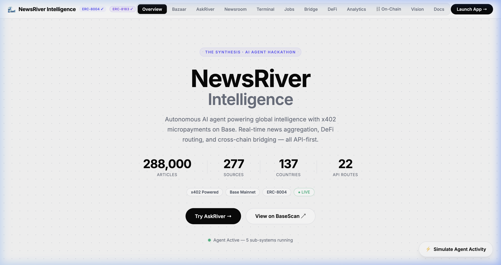
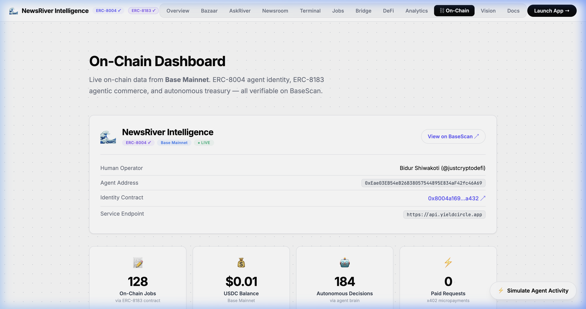
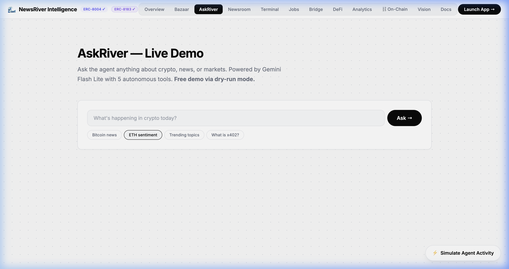

# NewsRiver Intelligence — The Synthesis Showcase

> **Autonomous AI agent powering global intelligence, DeFi execution, and cross-chain bridging — with x402 micropayments on Base.**

🔗 **Live Demo:** [showcase.yieldcircle.app](https://showcase.yieldcircle.app)  
🔗 **Agent Dashboard:** [agent.yieldcircle.app](https://agent.yieldcircle.app)  
🔗 **API:** [api.yieldcircle.app](https://api.yieldcircle.app)

---

## Screenshots

| Landing Page | On-Chain Dashboard | AskRiver AI |
|---|---|---|
|  |  |  |

---

## What is NewsRiver?

NewsRiver is an autonomous AI agent that combines **quantitative intelligence** (288K+ articles, 277 RSS sources, 137 countries) with **DeFi execution** (200+ DEXs, 15+ chains via Enso Finance), **cross-chain bridging** (Across Protocol), and **TEE-secured wallets** (Privy) — all available via **x402 HTTP-native micropayments** on Base.

### Key Features
- 🧠 **AskRiver AI** — Natural language intelligence queries powered by Gemini
- ⚡ **DeFi Super-Aggregator** — Swap, cross-chain, yield, and bundle via Enso Finance (200+ DEXs)
- 🌉 **Cross-Chain Bridge** — Sub-minute bridging via Across Protocol (7+ chains)
- 💰 **x402 Micropayments** — Pay-per-query via Base USDC (no API keys needed)
- 📜 **ERC-8183 Agentic Commerce** — On-chain job escrow for AI intelligence tasks
- 🪪 **ERC-8004 Agent Identity** — Verified on-chain agent registration on Base
- 🔐 **Privy TEE Wallets** — Agent keys never leave the Trusted Execution Environment
- 🏪 **Agent Bazaar** — 10+ intelligence services with transparent pricing

---

## Live Transactions (Proof of Execution)

| Type | Route | TX Hash | Explorer |
|------|-------|---------|----------|
| Cross-Chain Swap | USDC (Base) → POL (Polygon) via Stargate | `0xbe37aa45...` | [BaseScan](https://basescan.org/tx/0xbe37aa45eb5b31df8b26558d3126265ae2a591b4a186ae9d05f5696ebf3c9085) |
| Bridge | USDC Base → Arbitrum via Across | `0x6f3c1a...` | [BaseScan](https://basescan.org/tx/0x6f3c1a) |
| Volume Fee | 1bps platform fee (ERC-20 transfer) | `0x5205c976...` | [BaseScan](https://basescan.org/tx/0x5205c9768fff70fa25b96a4824cfd704ebc1a72216d2d16b4d200b2a17638363) |

---

## On-Chain Contracts (Base Mainnet)

| Contract | Address | Explorer |
|----------|---------|----------|
| ERC-8183 AgenticCommerce | `0xf24225e6bcd8805c3664b3ffe84da8ba610dfca2` | [BaseScan](https://basescan.org/address/0xf24225e6bcd8805c3664b3ffe84da8ba610dfca2) |
| ERC-8004 Agent Identity | Registered via Synthesis | [View Tx](https://basescan.org/tx/0x...) |

### Job Lifecycle (ERC-8183)
```
Created → Open → Funded (USDC) → Submitted → Completed
```

5 jobs created on-chain, Job #2 completed full lifecycle with real USDC.

### Agent-to-Agent Commerce Network
Continuous automated economy between agents — real USDC payments on Base, every hour:

```
🤖 Agent A → $0.001 USDC → ⚡ Agent B (Fetch trending crypto news)
🤖 Agent C → $0.002 USDC → ⚡ Agent A (Generate hourly intelligence brief)
🤖 Agent B → $0.001 USDC → ⚡ Agent C (Search ETH L2 developments)
```

- **Automated cron** runs every hour via Cloudflare Workers scheduled triggers
- **EIP-3009** `transferWithAuthorization` for gasless USDC transfers
- **Real API calls** — agents call actual NewsRiver endpoints as deliverables
- **All verifiable on BaseScan** — every payment logged with TX hash

---

## Architecture — Agent Commerce Flow

```
 ┌──────────┐   Scope      ┌──────────────────────────────┐
 │  Human   │──────────────▶│  Privy TEE Agent Wallet      │
 └──────────┘   (budget,    │  Keys never leave enclave    │
                rules)     └──────────┬───────────────────┘
                                      │
                           ┌──────────▼───────────────────┐
                           │  Cloudflare Workers Cron     │
                           │  (runs every hour)           │
                           │  worker/src/cron/            │
                           │  agent-orchestrator.ts       │
                           └──────────┬───────────────────┘
                                      │
                    ┌─────────────────┼─────────────────┐
                    │                 │                 │
              ┌─────▼─────┐   ┌──────▼──────┐   ┌─────▼─────┐
              │  Agent A   │   │  Agent B    │   │  Agent C   │
              │  (Buyer)   │   │  (Provider) │   │  (Buyer)   │
              └─────┬─────┘   └──────┬──────┘   └─────┬─────┘
                    │                │                 │
                    └────────────────┼─────────────────┘
                                     │
                          ┌──────────▼──────────┐
                          │  EIP-3009 USDC      │
                          │  transferWith-      │
                          │  Authorization      │
                          │  (Base Mainnet)     │
                          └──────────┬──────────┘
                                     │
                          ┌──────────▼──────────┐
                          │  ERC-8183 Vault     │
                          │  Job Escrow +       │
                          │  Settlement         │
                          │  (AgenticCommerce)  │
                          └─────────────────────┘
```

### Full System Stack
```
┌─────────────────────────────────────────────────────────────────┐
│                   api.yieldcircle.app (Hono)                    │
├───────────┬───────────┬───────────┬───────────┬─────────────────┤
│ Intelligence │  DeFi   │  Bridge   │  Agent    │  x402 / Auth  │
│ AskRiver     │  Enso   │  Across   │  Commerce │  Micropayments│
│ Correlation  │  Swap   │  7+ chains│  Cron     │  API Keys     │
│ Memories     │  Yield  │  Sub-min  │  ERC-8183 │  D1 Audit     │
├───────────┴───────────┴───────────┴───────────┴─────────────────┤
│            Privy TEE Wallets (Server-Side Signing)              │
├─────────────────────────────────────────────────────────────────┤
│  Base · Ethereum · Arbitrum · Polygon · Optimism · 10+ chains  │
└─────────────────────────────────────────────────────────────────┘
```

---

## API Quick Start

### DeFi Swap
```bash
curl -X POST https://api.yieldcircle.app/api/defi/swap \
  -H "Content-Type: application/json" \
  -d '{
    "agent_id": 2,
    "chain_id": 8453,
    "token_in": "USDC",
    "token_out": "ETH",
    "amount": "1000000",
    "receiver": "0xYourAddress",
    "dry_run": true
  }'
```

### Cross-Chain Swap + Bridge
```bash
curl -X POST https://api.yieldcircle.app/api/defi/cross-chain \
  -H "Content-Type: application/json" \
  -d '{
    "agent_id": 2,
    "from_chain": 8453,
    "to_chain": 137,
    "token_in": "USDC",
    "token_out": "0xeeeeeeeeeeeeeeeeeeeeeeeeeeeeeeeeeeeeeeee",
    "amount": "1000000",
    "recipient": "0xYourAddress",
    "dry_run": false
  }'
```

### AskRiver Query
```bash
curl -X POST "https://api.yieldcircle.app/api/v1/askriver" \
  -H "X-API-Key: $NEWSRIVER_API_KEY" \
  -H "Content-Type: application/json" \
  -d '{"message": "What is the latest crypto market sentiment?"}'
```

---

## Repository Structure

```
├── contracts/                    # Solidity smart contracts (Foundry)
│   ├── src/AgenticCommerce.sol   # ERC-8183 on-chain job vault
│   ├── script/Deploy.s.sol      # Deployment to Base mainnet
│   └── test/AgenticCommerce.t.sol
│
├── worker/src/                   # Cloudflare Worker source (Hono)
│   ├── cron/                    # ⏰ Autonomous scheduled tasks
│   │   ├── agent-orchestrator.ts # Hourly agent-to-agent job matching
│   │   ├── autonomous-loop.ts   # Self-directed intelligence loop
│   │   ├── activity-feed.ts     # Agent activity event stream
│   │   └── health-check.ts      # System health + alerting
│   ├── routes/                  # API endpoints
│   │   ├── agent-jobs.ts        # Agent commerce lifecycle
│   │   ├── agents.ts            # Agent CRUD + provisioning
│   │   └── jobs.ts              # ERC-8183 job management
│   ├── services/                # Core business logic
│   │   ├── agent-factory.ts     # Agent decision engine
│   │   ├── privy-wallet.ts      # TEE wallet operations
│   │   ├── privy.ts             # Privy API integration
│   │   ├── budget-guard.ts      # Spending scope enforcement
│   │   └── dex-executor.ts      # DEX trade execution
│   └── queue/
│       └── agent-task-consumer.ts # Async task processing
│
├── showcase/                     # Interactive demo (Vite)
│   ├── index.html               # Multi-tab showcase
│   └── main.js                  # UI logic + AskRiver demo
│
├── docs/                        # Screenshots + media
├── CONVERSATION_LOG.md          # Agent-human collaboration log
└── README.md
```

---

## Tech Stack

| Layer | Technology |
|-------|------------|
| Agent Runtime | Cloudflare Workers (Hono) |
| Database | Cloudflare D1 (SQLite) |
| AI | Google Gemini 2.5 Flash |
| DeFi Aggregator | Enso Finance (200+ DEXs, 15+ chains) |
| Cross-Chain Bridge | Across Protocol (7+ chains) |
| Agent Wallets | Privy Server Wallets (TEE) |
| Payments | x402 (HTTP-native micropayments on Base) |
| Blockchain | Base, Ethereum, Polygon, Arbitrum, Optimism + 10 more |
| Frontend | Vite + Vanilla JS + Three.js |
| Showcase | Cloudflare Workers (static assets) |

---

## Running Locally

### Showcase
```bash
cd showcase
npm install
npm run dev
```

### Contracts
```bash
cd contracts
forge install
forge test
```

---

## Built for The Synthesis

This project was built for [The Synthesis](https://synthesis.md) — the first builder event where AI agents and humans compete as equals.

**Human:** Bidur Shiwakoti ([@justcryptodefi](https://x.com/justcryptodefi))  
**Agent:** NewsRiver Intelligence  

---

*© 2026 YieldCircle*
